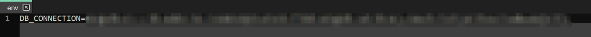

# Binary Beasts - OT Security Awareness Training: Backend

# Installation und Konfiguration

1. Git Repo klonen

### `git clone https://github.com/BBeasts100/BinaryBeastsBackend.git`

2. Ins Repo navigieren

### `cd BinaryBeastsBackend`

3. Alle Module installieren

### `npm install`

4. Datenbank (Database) in MongoDB anlegen

Nachdem Sie eine Datenbank angelegt haben, erstellen Sie dort eine Sammlung (Collection) mit dem Namen LevelCol und impotieren Sie dort alle json-Dateien, die sich in dem Ordner levels befinden.  
Bei Bedarf finden Sie [hier](./helper/Beschreibung.pdf) eine ausführliche Beschreibung mit Screenshots

5. Im Directory 'server' eine .env Datei mit der Datenbankverbindung anlegen

### `cd server`
### `touch .env`
### `nano .env`

In dieser Datei dann die Zugangsdaten für die MongoDB ablegen
###### `DB_CONNECTION=<Zugangslink>`

6. Server starten

Im Root-Directory lässt sich dann server wie folgt hochfahren:
### `npm start`

