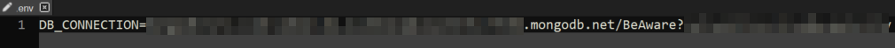

# Binary Beasts

  

# OT Security Awareness Training: Be-Aware
Diese Software ist im Rahmen eines Software-Entwicklungsprojekts von der Hochschule Mannheim im Studiengang CSB durch die Gruppe Binary Beasts entstanden. Die Anwendung hat den Zweck, Automatisierungsingeniuere im Feld der OT-Security-Awareness durch ein interaktives Schulungskonzept zu schulen. 

## Installation und Konfiguration

1. Git Repo klonen

#### `git clone https://github.com/cep-sose2022/binary-beasts.git`

2. In den backend Ordner navigieren

#### `cd backend`

3. Alle Module installieren

#### `npm install`

4. Datenbank (Database) in MongoDB mit dem Namen 'BeAware' anlegen

Nachdem Sie eine Datenbank angelegt haben, erstellen Sie dort eine Sammlung (Collection) mit dem Namen 'LevelCol' und importieren Sie dort alle json-Dateien, die sich in dem Ordner levels befinden.  
Bei Bedarf finden Sie [hier](backend/helper/Beschreibung.pdf) eine ausführliche Beschreibung mit Screenshots

5. Im Directory 'server' eine .env Datei mit der Datenbankverbindung anlegen

#### `cd server`
#### `touch .env`
#### `nano .env`

In dieser Datei dann die Zugangsdaten für die MongoDB ablegen
###### `DB_CONNECTION=<Zugangslink>`

Hinweis: Achten Sie darauf, dass im Zugangslink der Pfad zur Datenbank enthalten ist, indem sie am Ende der URL '/BeAware' hinzufügen

6. Server starten

Im backend-Directory lässt sich dann server wie folgt hochfahren:
#### `npm start`
Der Server für Backend wird auf http://localhost:5000/ laufen

7. In den frontend Ordner navigieren

#### `cd frontend`

8. In den client Ordner navigieren

#### `cd client`

9. Alle Module installieren

#### `npm install`

10. Server starten

Im client-Directory lässt sich dann server wie folgt hochfahren:

#### `npm start`
Der Server für Frontend wird auf http://localhost:3000/ laufen

## Technologien
- React
- Express
- Node.js
- MongoDB

## Architektur
Die Architektur der Software ist [hier](frontend/Be-Aware_Architektur.pdf) hinterlegt.

## Limitations

1. Unsichere Login-Authentifikation

Sobald man sich auf der Webseite eingeloggt hat, wird der Username im Local-Storage gespeichert. Anhand dieses Eintrags wird entschieden, ob man eingeloggt ist oder nicht, und es werden die individuellen Daten zu diesem Nutzer angezeigt. Daher können Nutzer anhand des Leaderboards die Usernamen von den anderen Nutzern herausfinden und sich anhand dessen als diese Nutzer einloggen, indem man mit den Developer-Tools den Local-Storage manipuliert.

2. Keine Optimierung für Safari

Benutzt man die Software im Safari-Browser, so wird man z.B. im Level "Social Engineering und Phishing" auf ein Problem stoßen: Die Ereignis-Bilder sind zu groß und überdecken die Karten und den Ereignis-Text. Dieses Problem tritt jedoch nur im Safari-Browser auf, auf den anderen bekannten Browsern existiert dieses Problem nicht

## Lizenz
Die Software ist lizenziert durch die [MIT-License](LICENSE)
